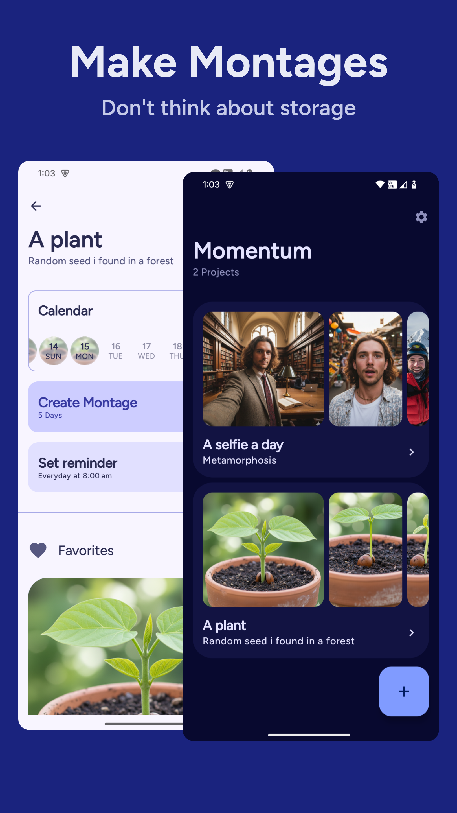

# Momentum

### App to make montages easily, in the works

> 
> 
> 

## Screenshots 📱

|  |  |
|:-------------------------------------------------------------------------:|:-------------------------------------------------------------------------:|
|  |  |
|  |  |

## Features ✨

> - [x] Daily reminders
>- [x] Montage maker with customisations
>- [x] Auto face stabilisation
>- [x] Calendar View
