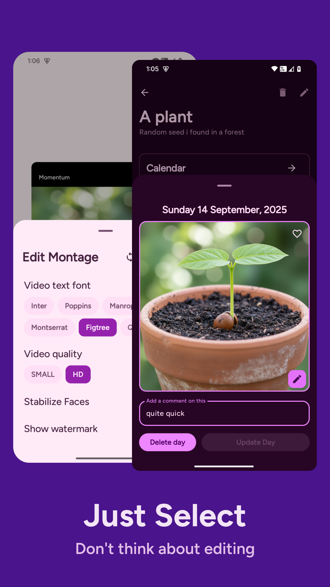
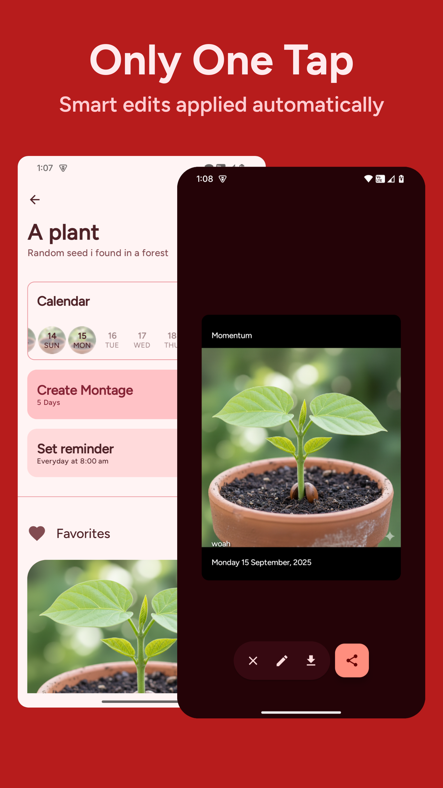
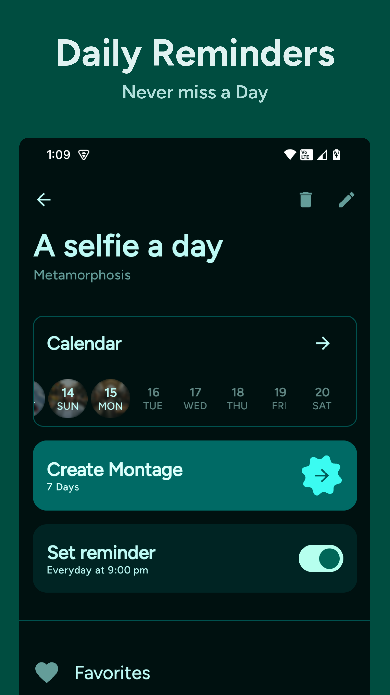
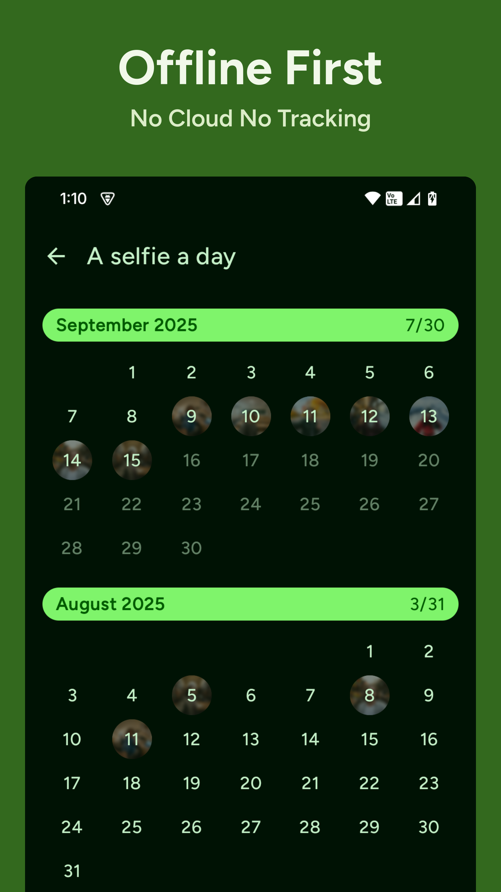
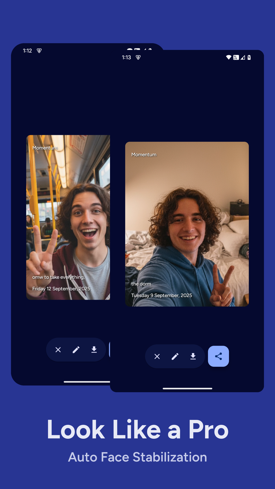

## Screenshots

|  |  |
|:-------------------------------------------------------------------------:|:-------------------------------------------------------------------------:|
|  |  |
|  |  |

## Features

- [x] Montage maker with customisations
- [x] Auto face stabilisation
- [x] Calendar View
- [x] Daily reminders

## Motivation

I always wanted a simple app to make making montages like [this](https://youtu.be/65nfbW-27ps)
effortless and convenient.
This has been brewing in my mind for over an year and Revenuecat shipaton 2025 was the best excuse
to give myself a challenge to build it.
This app is offline first and privacy friendly, everything stays on your device.

## Inspiration and Tech used

- [Agelapse](https://github.com/hugocornellier/agelapse) by Hugo Cornellier (the guy who started it
  all)
- [Daily You](https://github.com/Demizo/Daily_You)
- Kotlin and Jetpack Compose 🖤
- [MaterialKolor](https://github.com/jordond/MaterialKolor)
- [ColorPicker Compose](https://github.com/skydoves/colorpicker-compose)
- [Landscapist](https://github.com/skydoves/landscapist)
- [Revenuecat Android SDK](https://github.com/RevenueCat/purchases-android)
- [FileKit](https://github.com/vinceglb/filekit)
- [Mediapipe Tasks Vision](https://github.com/google-ai-edge/mediapipe)
- [Compose Calendar](https://github.com/boguszpawlowski/ComposeCalendar)